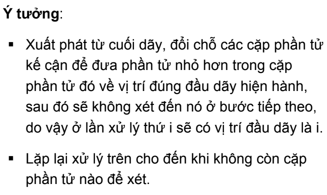

# Tìm kiếm và sắp xếp nội
## Các giải thuật tìm kiếm Nội
### Tìm kiếm tuyến tính
Cho danh sách có n phần tử a<sub>1</sub>,a<sub>2</sub>,...,a<sub>n</sub>.Tìm phần tử có khoá bằng X trong mảng
- ##### Giải thuật tìm kiếm tuyến tính (tìm tuần tự)
    Vòng lặp chạy đến độ dài mảng, trong quá trình chạy thêm điều kiện dừng của mảng là tìm thấy giá trị X. O<sub>min</sub> = 1, O<sub>max</sub> = n
    Chúng ta cải tiến bằng cách đặt "lính canh", đặt giá trị cần tìm vào độ dài mảng + 1
    ```
     a[n+1]=X;
     while(a[i]!=X) ++i;
     if(i == n+1) -> "Not Found"; else -> "Value is in array"
    ```
    > Đảm bảo luôn tìm kiếm thấy X trong mảng
- ##### Giải thuật tìm kiếm nhị phân
    **Muốn áp dụng thuật toán thì mảng phải có tính đơn điệu**
    
    O<sub>min</sub> = 1, O<sub>max</sub> = log<sub>2</sub>N/2. 
    >Ngoài ra, có thể dùng lower_bound (tìm vị trí lớn hơn hoặc bằng giá trị cần tìm) hoặc upper_bound (tìm vị trí lớn hơn hẳn giá trị cần tìm). 
## Các thuật toán sắp xếp
### 1.Đổi chỗ trực tiếp - Interchange Sort


### 2.Chọn trực tiếp - Selection Sort


### 3.Nổi bọt - Bubble Sort


### 4.Shaker Sort


### 5.Insertion Sort


### 6.Chèn nhị phân - Binary Insertion Sort
Với mỗi giá trị a<sub>i</sub> tìm kiếm vị trí thích hợp để thay thế a<sub>i</sub> và đẩy các giá trị khác.
Ở đây, chúng ta dùng thuật toán Binary Search để tìm kiếm nên độ phức tạp thuật toán sẽ giảm xuống so với việc for để tìm
### 7.Shell Sort


Tham khảo thêm: [link](https://tek4.vn/khoa-hoc/cau-truc-du-lieu-va-giai-thuat/thuat-toan-sap-xep-shell-sort)
### 8.Heap Sort
Lấy ý tưởng từ Heap.Trong C++, cũng có hỗ trợ hàm 
### 9.Quick Sort
- Chia mảng gồm n phần tử thành những đoạn con có độ dài nhỏ hơn, tư tưởng chia để trị
- Trong C++ có hỗ trợ hàm sort() - thời gian tương đương với giải thuật Quick Sort
### 10.Merge Sort

### 11.Radix Sort 
